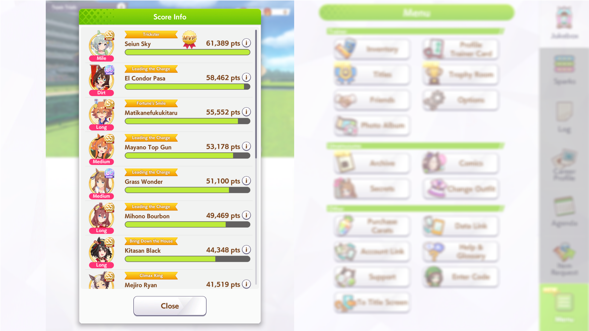
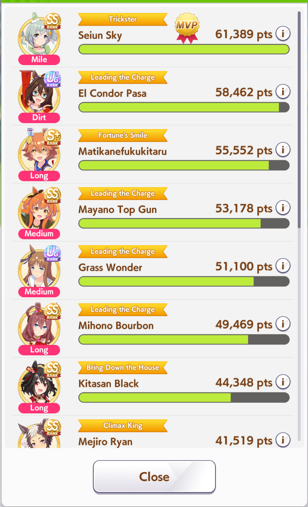

Extract The score info card from **Umamusume: Pretty Derby** screenshots.
Works on screenshots from desktop and mobile.

```txt
umage_detector — Score info cropper

USAGE:
  umage_detector [OPTIONS] <PATH>

FLAGS:
  -h, --help                 Prints help information
  -d, --debug                Enables debug output (writes intermediate image)
  -b, --batch                Processes input as batch (directory mode)

OPTIONS:
  --low-threshold VALUE      Canny low threshold [default: 50.0]
  --high-threshold VALUE     Canny high threshold [default: 60.0]
  -o, --output PATH          Output directory [default: current directory]

ARGS:
  <PATH>                     Input image or directory path
```

Run with `cargo run -- [OPTIONS] <PATH>`

`cargo run -- example/Example.png -o example`
`cargo run -- -b example -o example`

You probably should not touch the threshold values unless you have issues with edge detection. You can check this with the debug flag.

## Examples

### Input



### Output


